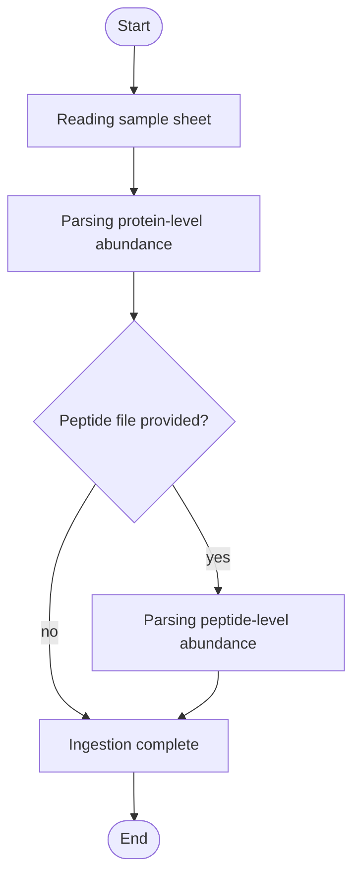

# Lyso-IP Ingestion


## Installation

**[⬇️ Click here to install in Cauldron](http://localhost:50060/install?repo=https%3A%2F%2Fgithub.com%2Fnoatgnu%2Flysoip-ingestion-plugin)** _(requires Cauldron to be running)_

> **Repository**: `https://github.com/noatgnu/lysoip-ingestion-plugin`

**Manual installation:**

1. Open Cauldron
2. Go to **Plugins** → **Install from Repository**
3. Paste: `https://github.com/noatgnu/lysoip-ingestion-plugin`
4. Click **Install**

**ID**: `lysoip-ingestion`  
**Version**: 1.0.0  
**Category**: lysoip-qc  
**Author**: CauldronGO Team

## Description

Converts a Spectronaut, FragPipe, DIA-NN, or generic tidy search-engine export into the tidy long-format files the lysoip-* plugin suite consumes


## Workflow Diagram



## Runtime

- **Environments**: `python`

- **Entrypoint**: `lysoip_ingestion.py`

## Inputs

| Name | Label | Type | Required | Default | Visibility |
|------|-------|------|----------|---------|------------|
| `format` | Search Engine Format | select (Spectronaut / DIA-NN long-format report, FragPipe combined_protein.tsv, DIA-NN report.pg_matrix.tsv, Generic tidy protein x sample matrix) | Yes | generic_tidy | Always visible |
| `raw_file` | Protein-Level Raw File | file | Yes | - | Always visible |
| `peptide_file` | Peptide-Level Raw File | file | No | - | Always visible |
| `sample_sheet_file` | Sample Sheet | file | Yes | - | Always visible |
| `require_proteotypic` | Require Proteotypic Peptides | boolean | No | true | Always visible |

### Input Details

#### Search Engine Format (`format`)

Which search engine produced the raw file

- **Options**: `spectronaut` (Spectronaut / DIA-NN long-format report), `fragpipe` (FragPipe combined_protein.tsv), `diann` (DIA-NN report.pg_matrix.tsv), `generic_tidy` (Generic tidy protein x sample matrix)

#### Protein-Level Raw File (`raw_file`)

Spectronaut/DIA-NN long report, FragPipe combined_protein.tsv, DIA-NN report.pg_matrix.tsv, or a generic tidy protein x sample matrix, matching the selected format


#### Peptide-Level Raw File (`peptide_file`)

Optional companion peptide-level file (report.pr_matrix.tsv for DIA-NN, combined_peptide.tsv for FragPipe, etc.). Enables downstream msqrob2-based differential expression instead of limma.


#### Sample Sheet (`sample_sheet_file`)

Maps each raw file's sample identifiers to an ip/wcl group and a replicate index

- **Table Editor**: Enabled with 3 columns
  - **Columns**:
    - `Sample`: Sample (required)
      - Sample identifier matching a column/value in the raw file (e.g. R.FileName, or a FragPipe/DIA-NN column name)
    - `Group`: Group (required)
      - Must be exactly 'ip' or 'wcl'
    - `ReplicateIndex`: Replicate Index (required)
      - Biological replicate number within this sample's group

#### Require Proteotypic Peptides (`require_proteotypic`)

Drop peptides DIA-NN flags as shared across more than one protein; only relevant for the diann format


## Outputs

| Name | File | Type | Format | Description |
|------|------|------|--------|-------------|
| `samples` | `samples.tsv` | data | tsv | Resolved sample -> group/replicate mapping |
| `abundance_long` | `abundance_long.tsv` | data | tsv | Protein-level abundance in long format (sample, protein, gene, value) — the shared input every other lysoip-* plugin expects |
| `peptide_abundance_long` | `peptide_abundance_long.tsv` | data | tsv | Peptide-level abundance in long format (sample, peptide, protein, gene, value). Present only when a peptide-level raw file was given. |

## Requirements

- **Python Version**: >=3.11

### Package Dependencies (Inline)

Packages are defined inline in the plugin configuration:

- `pandas>=2.0.0`

> **Note**: When you create a custom environment for this plugin, these dependencies will be automatically installed.

## Example Data

This plugin includes example data for testing:

```yaml
  sample_sheet_file: examples/diann_sample_sheet.csv
  format: diann
  raw_file: examples/diann_pg_matrix.tsv
  peptide_file: examples/diann_pr_matrix.tsv
```

Load example data by clicking the **Load Example** button in the UI.

## Usage

### Via UI

1. Navigate to **lysoip-qc** → **Lyso-IP Ingestion**
2. Fill in the required inputs
3. Click **Run Analysis**

### Via Plugin System

```typescript
const jobId = await pluginService.executePlugin('lysoip-ingestion', {
  // Add parameters here
});
```
